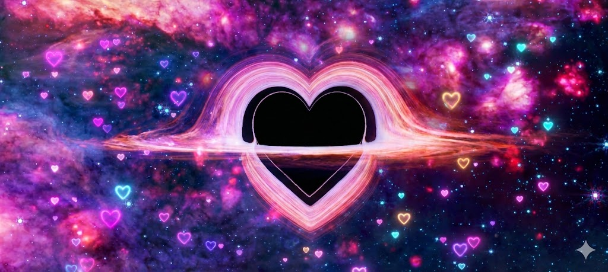

# 🚀 Cosmic Valentine Proposal ❤️

A spectacular, interactive web experience designed to pop the question in style! This single-page application features cinematic animations, a dynamic starfield, immersive audio, and a playful "No" button that refuses to be clicked.

## ✨ Features

- **🌌 Cinematic Intro**: A stunning portal transition effect when the answer is "YES!".
- **⭐ Dynamic Starfield**: Procedurally generated stars and shooting stars with a warp speed effect upon clear success.
- **🖱️ Interactive Cursor**: A glowing cursor trail with "stardust" particles that react to movement.
- **🚫 The Unclickable "No"**: The "No" button actively evades the cursor, taunting the user with fun phrases like *"Think again!"* and *"You're my Love ;)"*.
- **🔥 Escalating Intensity**: If the user persists, the "YES" button grows larger and eventually unleashes a **"GET OVER HERE!!"** mode with intense visual effects.
- **🎵 Immersive Audio**:
  - Background loop (`waiting.mp3`)
  - Sound effects for interactions (`get-over-here.mp3`, `yay.mp4`)
  - Cinematic finale music (`shooting-stars.mp3`)
- **🎬 Grand Finale**: A supernova video transition leading to a warping starfield and a glowing success message.

## 🛠️ How to Run

1.  **Download** or clone this repository.
2.  Ensure all audio and video assets are in the same folder as `Index.html`:
    - `waiting.mp3`
    - `get-over-here.mp3`
    - `yay.mp4`
    - `shooting-stars.mp3`
    - `Scene_a_spectacular_...mp4`
    - `space-heart.jpg`
3.  **Double-click** `Index.html` to open it in your web browser (Chrome, Edge, or Firefox recommended).
4.  **Important**: Click anywhere on the page first to enable audio autoplay permissions!

## 📂 Project Structure

- **`Index.html`**: The main entry point containing all HTML, CSS, and JavaScript logic.
- **Assets**:
  - `space-heart.jpg`: Background image.
  - `*.mp3 / *.mp4`: Audio and video effects.
- **`valentine-app/`**: Legacy React version (optional).

## 🎨 Credits

- **Fonts**: [Dancing Script](https://fonts.google.com/specimen/Dancing+Script) & [Inter](https://fonts.google.com/specimen/Inter) from Google Fonts.
- **Icons**: Standard Emoji set.

---
*Made with ❤️ for a special someone.*
